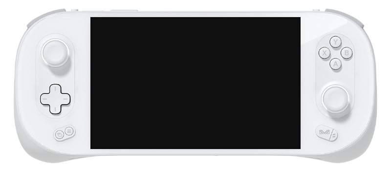

# AYANEO 2/2s

{ .off-glb }

## Features

| Feature&nbsp;&nbsp;&nbsp;&nbsp;&nbsp;&nbsp;&nbsp;&nbsp;&nbsp;&nbsp;&nbsp;&nbsp;&nbsp;&nbsp;&nbsp;&nbsp; | Notes |
| -- | -- |
| :material-harddisk: Storage | SteamFork can be run from an SD Card, USB Drive or installed directly to the internal NVME.
| :material-wifi: Wifi | Can be turned on in Steam OS under Main Menu > Network Settings. |
| :simple-bluetooth: Bluetooth | Supports bluetooth audio and controllers. |
| :material-fan: Fan | Managed automatically. |
| :material-lightning-bolt-circle: TDP Limit | Can be set globally, per system or per game. Requires the [SimpleDeckyTDP](https://github.com/SteamFork/SimpleDeckyTDP) plugin.|
| :material-vibrate: Rumble | Enables the device rumble motor in emulators that support it. |
| :material-lightbulb-on: RGB | Disabled on startup. Requires the [HueSync](https://github.com/honjow/HueSync) plugin for additional RGB control.|

## Notes

### Installation

Download the latest `AMD64` version of SteamFork from the button below and follow the instructions listed on the [Install](../../../play/install/) page.

### Booting from an external drive (USB or SD Card)

To boot SteamFork from an external drive, hold ++"LC"+"Volume Up"++ and press the ++"Power"++ button, continue holding ++"LC"+"Volume Up"++ until the Ayaneo logo appears.  Select the storage device with SteamFork from the boot menu using the Ayaneo button, and then press volume up to boot the distribution.
