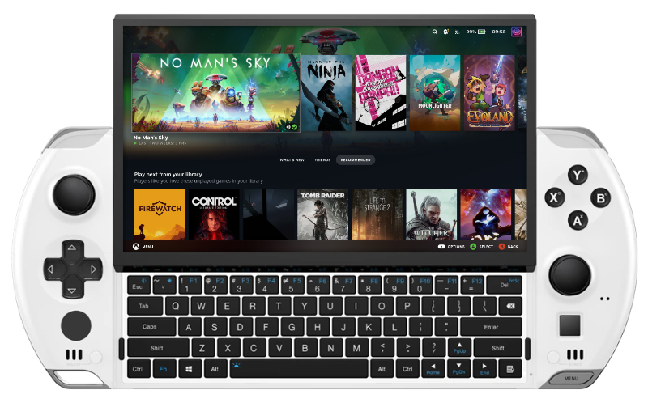

title: GPD Win 4 (AMD 6800U)

# GPD Win 4 (AMD 6800U)

{ .off-glb }

## Features

| Feature | Notes |
| -- | -- |
| <no-wrap>:material-harddisk: Storage</no-wrap> | SteamFork can be run from an SD Card, USB Drive or installed directly to the internal NVME.   When installed directly to the NVME; an SD Card can be used for game storage. |
| <no-wrap>:material-wifi: Wifi</no-wrap> | Can be turned on in Steam OS under `Main Menu` > `Network`. |
| <no-wrap>:simple-bluetooth: Bluetooth</no-wrap> | Supports bluetooth audio and controllers .|
| <no-wrap>:material-fan: Fan</no-wrap> | Requires the [FanControl](https://github.com/SteamFork/FanControl/releases) plugin.|
| <no-wrap>:material-lightning-bolt-circle: TDP Limit</no-wrap> | Can be set globally, per system or per game. Requires the [SimpleDeckyTDP](https://github.com/SteamFork/SimpleDeckyTDP) plugin.|
| <no-wrap>:material-vibrate: Rumble</no-wrap> | Enables the device rumble motor in software that supports it. |

### Function Buttons

| Button | Function |
| -- | -- |
| ++"Menu"++ | <kbd>:material-microsoft-xbox: Guide</kbd> <no-wrap>(`Steam Menu`)</no-wrap> |
| ++"L4"++ | ++"L4"++ |
| ++"R4"++ | ++"R4"++ |

## Notes

### Installation

Download the latest `AMD64` version of SteamFork from the button below and follow the instructions listed on the [Install](../../../play/install/) page.

### Booting from an external drive (USB or SD Card)

In order to launch SteamFork from a USB drive or SD Card you will need to first change the boot order in the BIOS.

During boot you can enter the bios by either pressing the ++del++ key on the built-in keyboard.

In the bios; navigate to the `Boot` menu and then change the boot order to prioritize the SD card under `Boot Order Priorities`.
Then go `Save & Exit` and select the Save Changes and Exit option.  This change will persist through all reboots.
If you want to boot into Windows simply remove the SD Card or USB drive.
