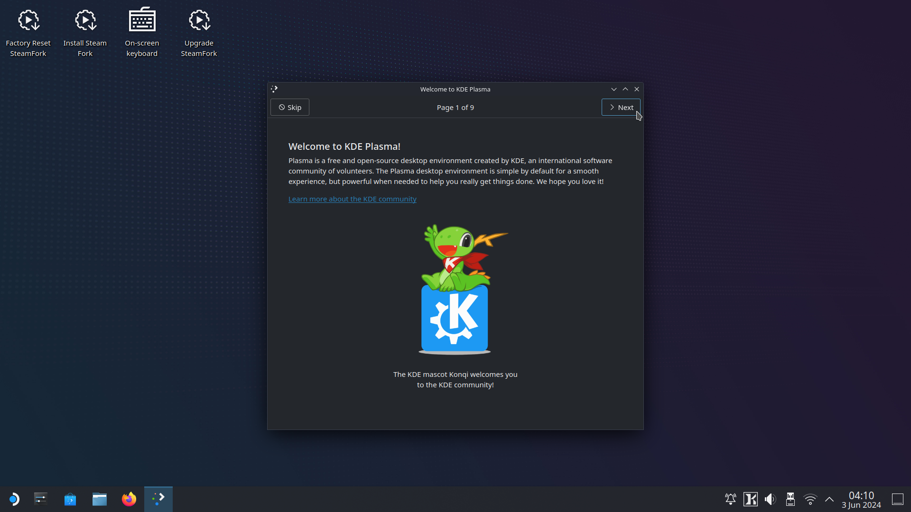
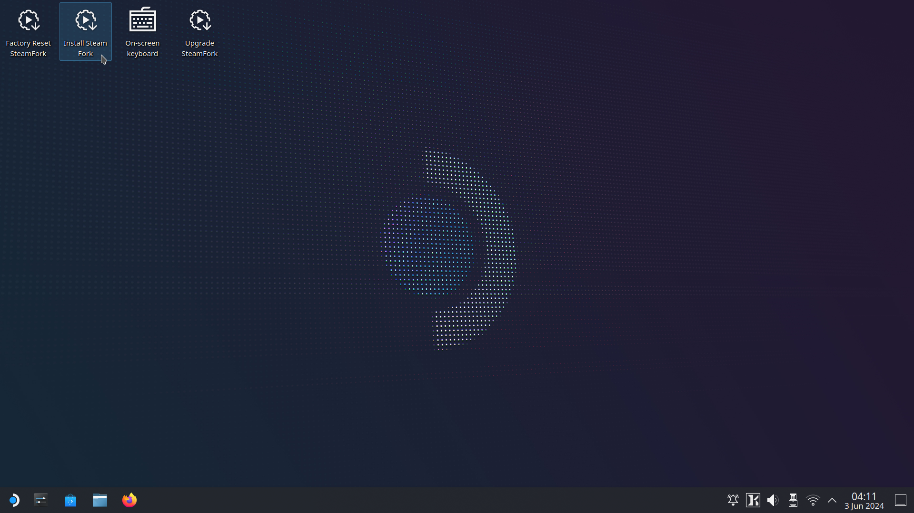
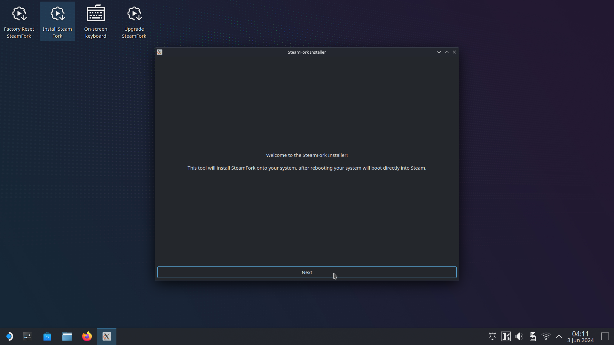
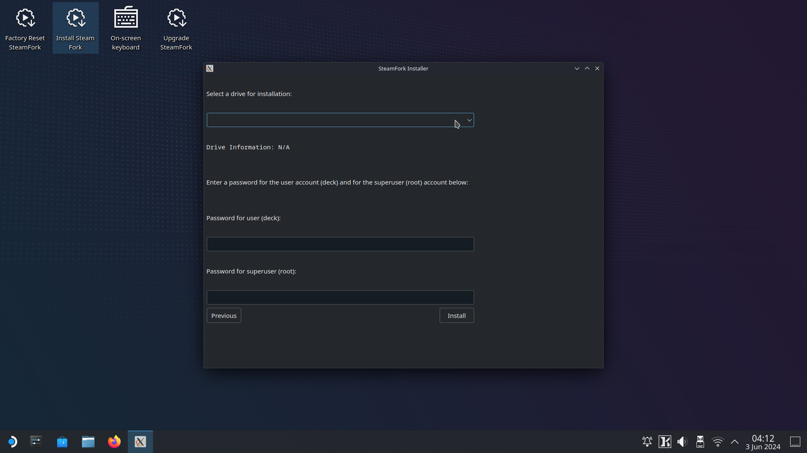
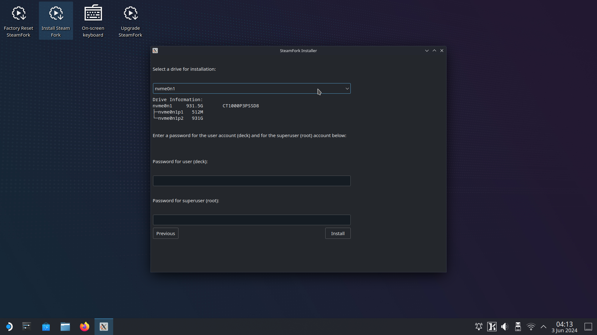
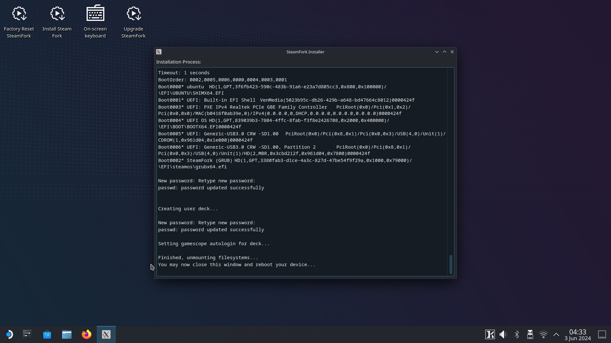

# :material-progress-check: Installing SteamFork

!!! info "SteamFork is compatible with Intel and AMD based systems.  NVidia GPUs are not supported."

SteamFork is installed by downloading an image, flashing it to an SD Card or USB Drive and then booting your device to run the SteamFork Live image.

## Step 1: Download 

* Download the latest version of SteamFork from the [releases page](https://github.com/SteamFork/distribution/releases/latest).

## Step 2: Flash

* Write the downloaded image to an SD Card or USB drive using your preferred imaging tool.
    * Common imaging tools include [Rufus](https://rufus.ie/), [Raspberry Pi Imager](https://www.raspberrypi.com/software/), and [Win32 Disk Imager](https://sourceforge.net/projects/win32diskimager/).  If you're skilled with the command line, `dd` can also be used.

## Step 3: Boot your device

* Insert your SD Card or USB Drive into your device while its off and then turn it on
* Note: Some devices may require you to set the boot order so your SD Card is loaded first.  Please see documentation for your specific device to see if this applies to you.
* SteamFork will boot its live image and you'll be able to run the SteamFork installer from that to install directly to the drive of your choice.

## Step 4: Run the SteamFork installer

* From the live mode desktop, open the "Install SteamFork" application and then follow the prompts to install to your device.
* Installing SteamFork will erase all data and partitions on selected drive. Make sure to backup your data before proceeding.
* When complete, close the installer, and shut down the device.  Remove the installation media, and then power the device on to boot into SteamOS.

Screenshots of this process:

<table>
  <tr>
    <td></td>
    <td></td>
  </tr>
  <tr>
    <td></td>
    <td></td>
  </tr>
  <tr>
    <td></td>
    <td></td>
  </tr>
</table>
